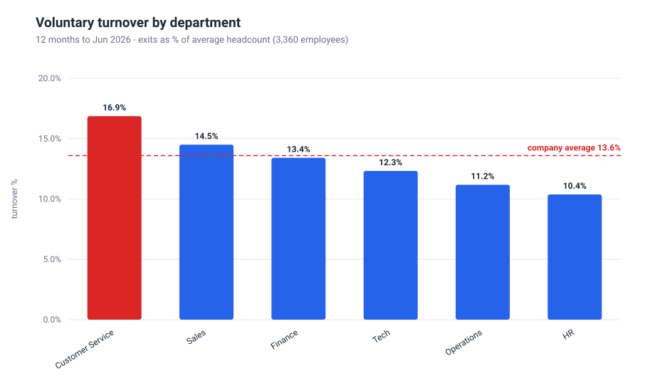
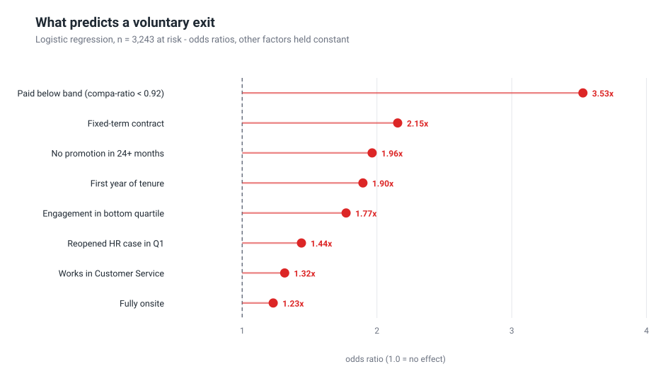
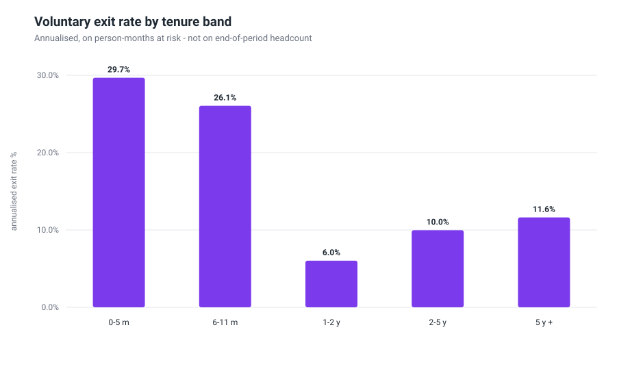
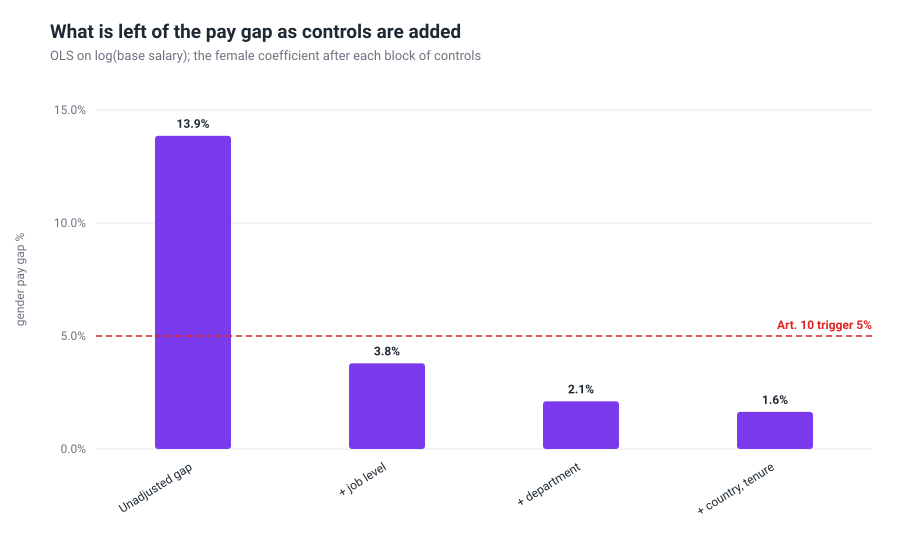
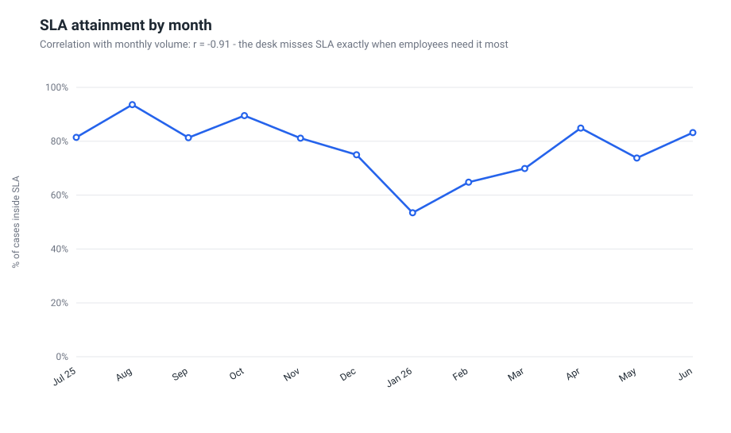

# People Analytics: attrition, pay equity and HR service delivery

Three questions every People function has to answer with numbers — *why are people leaving,
is our pay defensible, and is the HR service actually working* — answered end to end on a
4,000-employee European organisation: data model, SQL warehouse, statistics, charts and a
written report with recommendations.

[](https://github.com/D0M3N1C0X/hr-people-analytics/actions/workflows/ci.yml)


> **The data is synthetic**, generated with a fixed seed by [`src/generate_data.py`](src/generate_data.py).
> No real employee data is used anywhere. The methods, the metric definitions and the way the
> findings are argued are what this repository is for.

### ▶ [Read the report online](https://d0m3n1c0x.github.io/hr-people-analytics/)

Every chart and recommendation on one page, no install. The same text is in
[`reports/findings.md`](reports/findings.md).

---

## The headline findings

| | |
|---|---|
| **Voluntary turnover is 13.6%**, but it is not spread evenly — Customer Service runs at 16.9% and produces 36% of all exits on 30% of the workforce. | Employees paid **below 0.92 compa-ratio are 3.5x more likely to resign**, holding contract type, tenure, engagement and department constant. |
| **The gender pay gap is 15.4% unadjusted and 1.6% like-for-like** — 88% of the headline number is structural, not a pay-for-the-same-job problem. | **10 of 27 worker categories** would cross the 5% trigger for a joint pay assessment under the EU Pay Transparency Directive. |
| **SLA attainment is 76% against a 90% target**, and it collapses to 53% in January — the correlation between monthly volume and attainment is **r = −0.91**. | Cases that miss SLA **and** get reopened average **2.27 CSAT** against **4.69** for a clean resolution — and those reopened cases predict resignations nine months later. |





---

## What this project demonstrates

| HR domain | Analytics | Engineering |
|---|---|---|
| Turnover metrics defined properly (average headcount, voluntary vs involuntary, regretted attrition) | Logistic regression with a feature window / outcome window split to avoid look-ahead bias | Zero dependencies — stdlib Python only, runs anywhere |
| Cost of attrition with stated, changeable assumptions | Survival-style hazard on person-months at risk, not end-of-period headcount | Deterministic pipeline: same seed, same numbers, verified in CI |
| EU Pay Transparency Directive (2023/970): Art. 9 reporting items, Art. 10 joint pay assessment trigger | Nested OLS on log salary to separate structural from like-for-like pay gaps | SQL warehouse (SQLite) with CTEs, window functions and a view |
| HR service-desk operations: SLA, FCR, reopen rate, CSAT, deflection and capacity planning | Welch tests and p-values reported, small samples flagged rather than spun | Charts generated as SVG from scratch — no plotting library |
| Recommendations written for a leadership audience, not a technical one | Statistics implemented from first principles in [`src/statsx.py`](src/statsx.py) | Every figure and number in the report is reproduced by one command |

---

## Run it

```bash
python3 src/run_all.py
```

That regenerates the data, rebuilds the SQLite warehouse, runs the three analyses, writes
13 charts and assembles [`reports/findings.md`](reports/findings.md) plus a self-contained
[`reports/findings.html`](reports/findings.html) with every chart inlined. It takes a few
seconds and needs **no packages installed** — Python 3.10 or newer and nothing else.

```bash
python3 src/run_sql.py
```

runs the SQL layer against `data/hr.db` and prints the results as tables.

---

## What's inside

```
├── src/
│   ├── generate_data.py          synthetic HR data with documented, planted effects
│   ├── hrlib.py                  shared loading + HR metric definitions
│   ├── statsx.py                 OLS, logistic regression, Welch test - pure stdlib
│   ├── viz.py                    small SVG charting library
│   ├── build_db.py               CSV -> SQLite warehouse
│   ├── run_sql.py                runs the sql/ queries and prints results
│   ├── analysis_attrition.py     module 1
│   ├── analysis_pay_gap.py       module 2
│   ├── analysis_service_desk.py  module 3
│   ├── build_report_html.py      findings.md -> one self-contained HTML file
│   └── run_all.py                the whole pipeline, one command
├── sql/                          analysis queries: CTEs, window functions, cross-table joins
├── data/                         generated CSVs + data dictionary
└── reports/
    ├── findings.md               the written report
    ├── findings.html             the same report as one shareable file
    └── figures/                  13 SVG charts
```

---

## The three modules

### 1. Attrition & retention

Where the losses are, when in the lifecycle they happen, what predicts them, and what they cost.
The driver model is fitted on a **feature window** (Jul–Sep 2025) with the outcome measured in
the **following nine months**, so predictors are always observed before the exit they predict and
every employee carries the same exposure.



The risk curve is not a straight line down: 27.9% annualised in the first year, 6.0% for people
between one and two years, then rising again as promotion stagnation sets in. Two different
problems, two different fixes.

The model also does something useful to the department story — once pay position, contract type
and tenure are controlled for, the Customer Service effect stops being significant. That
department does not have a culture problem; it has a composition problem.

### 2. Pay equity, EU Pay Transparency Directive

Directive (EU) 2023/970 had to be transposed by **7 June 2026**; employers of this size report
by **7 June 2027 and every year thereafter** (Art. 9(2)), on the preceding calendar year.
This analysis runs on a snapshot of active employees at 30 June 2026 — the shape of the
exercise, not a statutory submission, and not legal advice. The module produces
the Article 9 reporting items and identifies the categories that would trip the Article 10
5% joint-pay-assessment trigger.



Adding controls one block at a time is the point: 15.4% raw, 3.8% once job level is held
constant, 1.6% fully adjusted. The remediation bill for the residual gap is small. Changing who
gets promoted — women are 38% of the top pay quartile and 60% of the bottom one — is the work
that actually moves the headline number.

### 3. HR service-desk performance

28,470 cases over twelve months: volume, seasonality, SLA, first-contact resolution, reopens
and CSAT, ending in three costed recommendations.



Capacity is flat, demand is not. The desk misses its promise precisely in the months when the
questions are about pay, tax and contracts.

---

## The SQL layer

Every headline number can also be produced in SQL — the same analysis in the language most HR
data lives in. From [`sql/03_service_desk.sql`](sql/03_service_desk.sql), the cross-table
question that links the two datasets:

```sql
WITH case_history AS (
    SELECT employee_id, SUM(reopened) AS reopened_cases
    FROM hr_cases
    WHERE created_date < '2025-10-01'          -- feature window only, no look-ahead
    GROUP BY employee_id
)
SELECT CASE WHEN COALESCE(h.reopened_cases, 0) = 0 THEN 'no reopened case'
            ELSE 'reopened case' END                                    AS service_experience,
       COUNT(*)                                                         AS employees,
       ROUND(100.0 * SUM(CASE WHEN e.exit_type = 'Voluntary'
                               AND e.exit_date >= '2025-10-01'
                              THEN 1 ELSE 0 END) / COUNT(*), 1)         AS exit_pct
FROM employees e
LEFT JOIN case_history h ON h.employee_id = e.employee_id
WHERE e.hire_date < '2025-10-01'
  AND (e.exit_date IS NULL OR e.exit_date >= '2025-10-01')
GROUP BY service_experience;
```

The queries cover recursive CTEs for the month series, `NTILE(4)` for pay quartiles, running
totals for Pareto analysis, `RANK()` for department risk and moving averages for case volume.

---

## Method notes

- **Turnover** is exits over the period divided by *average* headcount, not closing headcount,
  and voluntary is reported separately from involuntary.
- **Tenure risk** uses person-months at risk as the denominator, so employees who move between
  tenure bands during the year are counted where they actually were.
- **Odds ratios describe association, not causation.** They rank risk and point at where to
  look; the report says so wherever a number could be read as a promise.
- **Assumptions are stated and centralised**: replacement cost at 30% of annual salary, 40
  minutes of agent handling effort per case, 1,600 productive hours per FTE. Change them in
  `src/hrlib.py` or `src/analysis_service_desk.py` and every dependent number updates.
- **Small samples are flagged, not spun.** Pay-gap categories under ~50 employees carry wide
  intervals and are labelled as such in the report.

Full write-up of methods and limits at the end of [`reports/findings.md`](reports/findings.md).

## Data

Two linked tables — 4,000 employees and 28,470 HR cases over the twelve months to 30 June 2026.
Column-by-column definitions, and an honest list of the effects deliberately planted in the
generator, are in [`data/README.md`](data/README.md).

## About

Built by **Domenico Perroni** — HR advisory, people analytics and media education, based in Kraków.
[GitHub profile](https://github.com/D0M3N1C0X) · [LinkedIn](https://www.linkedin.com/in/domenico-perroni)

**More from the same portfolio**

- [pay-transparency-readiness-kit](https://github.com/D0M3N1C0X/pay-transparency-readiness-kit) — **continues the pay-equity module here**, adding bonus, commission and allowances and turning the analysis into the full Directive exercise: a live Excel model reconciled with pandas, a board briefing and the [report online](https://d0m3n1c0x.github.io/pay-transparency-readiness-kit/)
- [where-pay-transparency-bites](https://github.com/D0M3N1C0X/where-pay-transparency-bites) — Eurostat data for all 27 Member States, analysed in R: the published gender pay gap understates the gap inside sectors, most of all where it looks small; [article](https://d0m3n1c0x.github.io/where-pay-transparency-bites/), [dashboard](https://d0m3n1c0x.github.io/where-pay-transparency-bites/dashboard/) and [working paper](https://d0m3n1c0x.github.io/where-pay-transparency-bites/paper.pdf)
- [workforce-cost-model](https://github.com/D0M3N1C0X/workforce-cost-model) — the finance side of the organisation analysed here: Italian and Polish employer costs, the FY2026 budget variance and FY2027 scenarios in a live Excel model reconciled with pandas, with the [memo online](https://d0m3n1c0x.github.io/workforce-cost-model/)
- [engagement-survey-analytics](https://github.com/D0M3N1C0X/engagement-survey-analytics) — an employee engagement survey analysed end to end, with a [live dashboard](https://d0m3n1c0x.github.io/engagement-survey-analytics/) you can filter in the browser
- [job-search-agent](https://github.com/D0M3N1C0X/job-search-agent) — a job search run as a pipeline: public ATS board APIs, explainable fit scoring, funnel analytics
- [pompei-stratificata](https://github.com/D0M3N1C0X/pompei-stratificata) — Pompeii and Herculaneum from AD 79 to today, a [walkable model](https://d0m3n1c0x.github.io/pompei-stratificata/) with a sourced documentary dossier, in six languages

MIT licensed. Reuse anything here.
