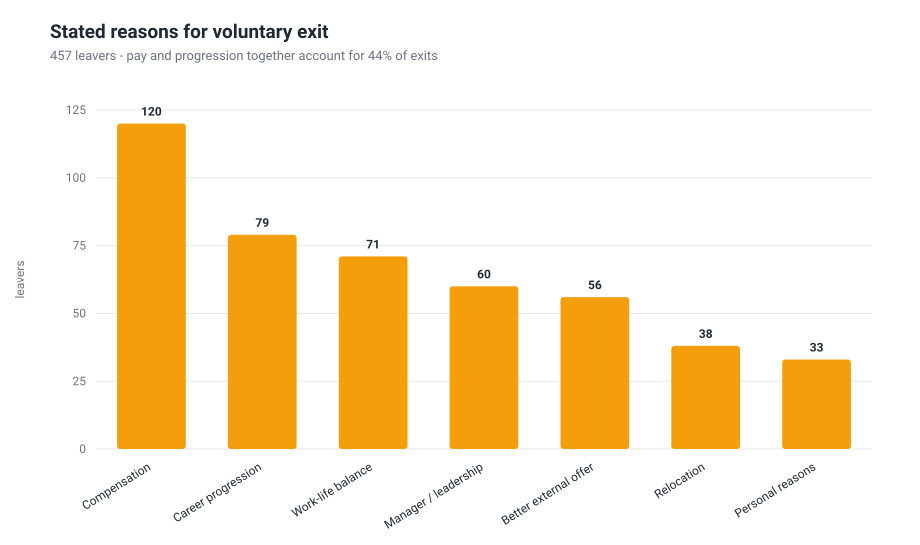
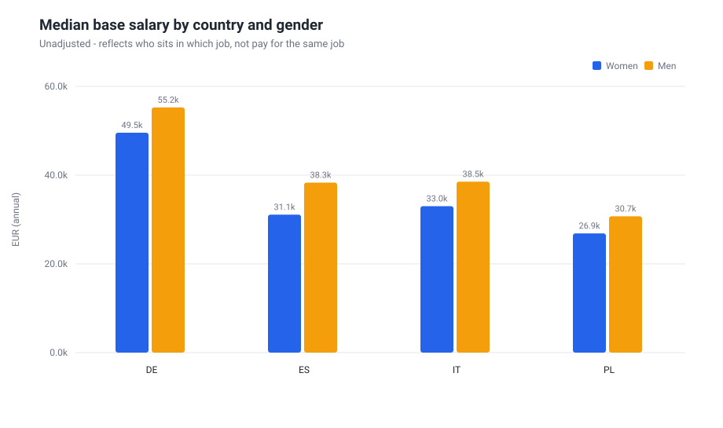
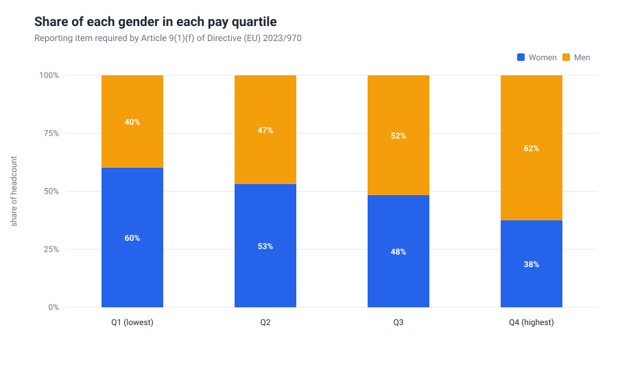
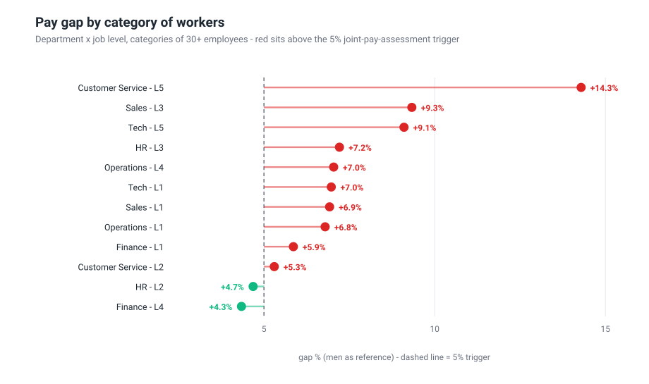
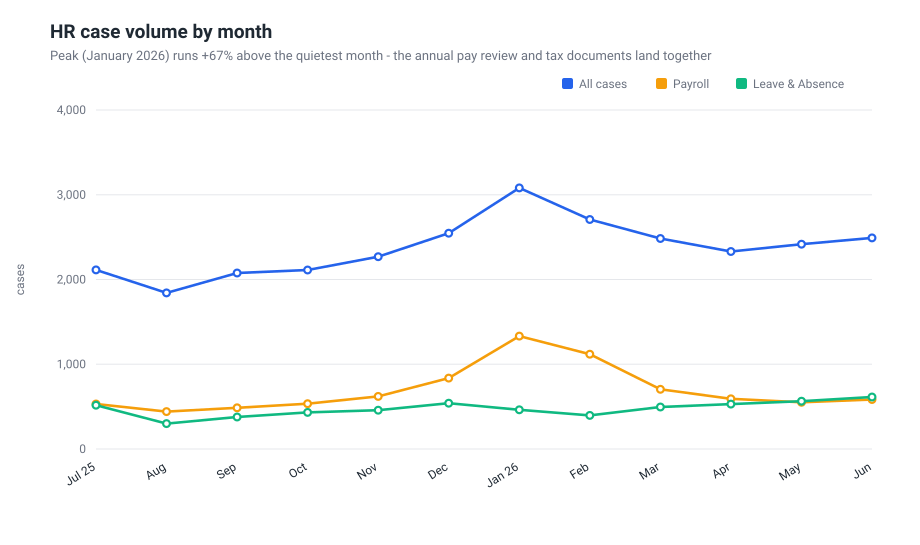
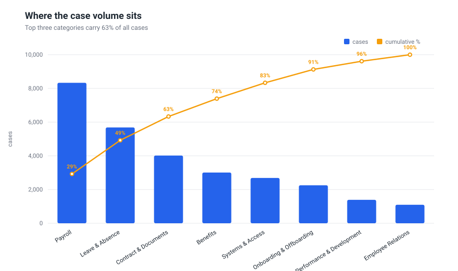
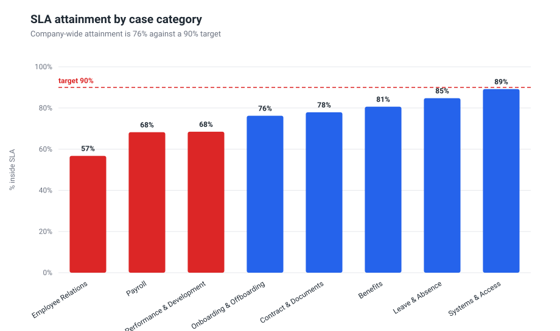
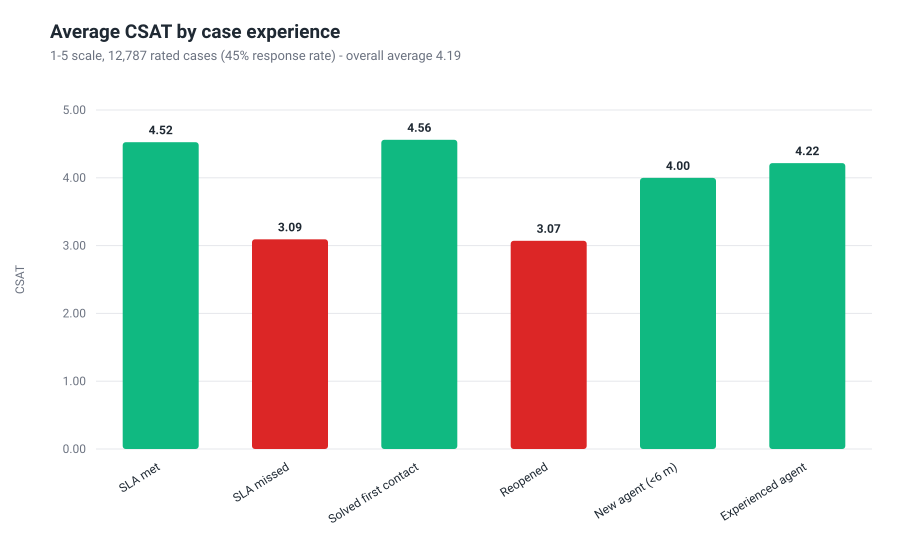

# People Analytics - findings

**Reporting period:** 01 July 2025 to 30 June 2026
**Population:** a synthetic European shared-services organisation across Italy, Poland,
Germany and Spain
**Generated by:** `python3 src/run_all.py` - every number and chart below is reproduced
from the code in this repository

> The data is synthetic and generated with a fixed seed (`src/generate_data.py`). No real
> employee data is used anywhere in this project. The analytical methods, the metric
> definitions and the recommendations are the parts meant to be judged.

---

## 1. Attrition & retention

**Headline.** Average headcount over the window is **3,360**. Voluntary turnover is **13.6%** (457 exits); total turnover, including dismissals and end-of-contract, is **16.6%**. **110** voluntary leavers - **24%** of them - held a performance rating of 4 or 5, so a quarter of the loss sits in the population you least want to lose.

**Where it is concentrated.** Customer Service runs at **16.9%**, **+3.3 pp** against the company average. It carries 30% of the workforce but produces **36%** of all voluntary exits.

| Department | Headcount share | Voluntary turnover | vs average |
| :--- | ---: | ---: | ---: |
| Customer Service | 30% | 16.9% | +3.3 pp |
| Sales | 13% | 14.5% | +0.9 pp |
| Finance | 10% | 13.4% | -0.2 pp |
| Tech | 15% | 12.3% | -1.3 pp |
| Operations | 24% | 11.2% | -2.4 pp |
| HR | 8% | 10.4% | -3.2 pp |

**When people leave.** On person-months at risk, the first year runs at **27.9%** annualised against **10.8%** for staff past two years - a **2.6x** difference. Early attrition is an onboarding, manager-quality and expectation-setting problem; it is rarely solved with money.

The curve is not a straight line down. It bottoms out at **6.0%** in the 1-2 y band and then climbs again to **11.6%** for the longest-serving staff. Those are two different problems wearing the same number: the first year is onboarding and expectation-setting, the later rise is promotion stagnation. A single retention programme aimed at 'attrition' would miss both.

### Driver analysis

Logistic regression on the **3,243 employees at risk on 1 Oct 2025**, predicting a voluntary exit in the following nine months from factors measured *before* that date. Odds ratios are read against a colleague who does not have the factor, with everything else in the model held constant - so overlapping effects (people below band are often also people waiting on a promotion) are not counted twice.

| Factor | Odds ratio | p-value | % of population |
| :--- | ---: | ---: | ---: |
| Paid below band (compa-ratio < 0.92) | 3.53x | <0.001 | 19% |
| Fixed-term contract | 2.15x | <0.001 | 18% |
| No promotion in 24+ months | 1.96x | <0.001 | 28% |
| First year of tenure | 1.90x | <0.001 | 23% |
| Engagement in bottom quartile | 1.77x | <0.001 | 26% |
| Reopened HR case in Q1 | 1.44x | 0.011 | 26% |
| Works in Customer Service | 1.32x | 0.052 | 29% |
| Fully onsite | 1.23x | 0.139 | 31% |

Pseudo-R2 (McFadden) = 0.122. The model ranks risk; it does not prove causation, and every factor here is something HR can act on.

Note what the model does to Customer Service. On its own it is the worst performer in the company; inside the regression the department term falls to **1.32x** (p = 0.05), which is not distinguishable from the rest of the business. Customer Service does not have a culture problem - it has a composition problem: it holds a disproportionate share of below-band salaries, fixed-term contracts and first-year staff. Fix those three and the department gap closes on its own.

**Cross-dataset finding.** Employees who had an HR case **reopened** in the feature window went on to resign at **10.8%** over the next nine months, against **7.7%** for everyone else; the effect survives the regression at **1.44x** (p = 0.011). A reopened case is rarely about the case: it signals an unresolved problem with pay, contract or manager. HR service quality is a retention variable, not only an efficiency one.

### What it costs

At **30% of annual base salary** per replacement - the mid-point of the 20-40% range commonly cited for non-executive roles, covering recruiting, onboarding and lost productivity - the 457 voluntary exits carry an estimated **EUR 5,083,380**, of which **EUR 1,279,635** sits with the high-performer group.

**Illustrative intervention.** 710 active employees (21% of the active population) sit below 0.92 compa-ratio. Bringing them to 0.95 of band costs **EUR 2,603,850** a year. Applying the estimated odds ratio to the base rate, that population would produce roughly **69 fewer resignations**, worth about **EUR 730,798** in avoided replacement cost - it recovers **28%** of the uplift bill in year one, before the productivity of the people who stay. Read honestly, that says a blanket uplift does not pay for itself: the version worth piloting is the targeted one, taking the below-band population inside Customer Service and the fixed-term cohort, where the odds ratios are highest and the salaries lowest. The estimate comes from an observational model and sizes the prize; it is not a causal guarantee.

## 2. Pay equity under the EU Pay Transparency Directive

Population: **3,443 active employees**, 50% women / 50% men. At this size - 250 workers or more - the organisation reports **by 7 June 2027 and every year thereafter** (Art. 9(2)), on the preceding calendar year. What follows is computed on a **snapshot of active employees at 30 June 2026**, which is the shape of the exercise rather than a statutory submission. Gaps are expressed with men as the reference, as in the Directive.

| Article 9 reporting item | Value |
| :--- | ---: |
| Mean gender pay gap | **15.4%** |
| Median gender pay gap | **14.6%** |
| Women in the highest pay quartile | 38% |
| Women in the lowest pay quartile | 60% |
| Median salary, women | EUR 33,450 |
| Median salary, men | EUR 39,150 |

*Scope: these are the Article 9 items this dataset can support, and they cover **base pay only**. A real submission also has to report the gap in complementary and variable components - bonus, allowances, benefits in kind - together with the proportion of each gender receiving them. Those components are frequently where the widest gaps sit, and they are not modelled here.*

### Where the gap actually comes from

The headline number is **15.4%**, but a headline gap does not say whether women are underpaid for the same work or under-represented in the jobs that pay more. Adding controls one block at a time separates the two.

| Model | Gender pay gap | p-value |
| :--- | ---: | ---: |
| Unadjusted gap | 13.9% | <0.001 |
| + job level | 3.8% | <0.001 |
| + department | 2.1% | 0.009 |
| + country, tenure | 1.6% | <0.001 |

*The regression works on log salary, so it estimates the ratio of geometric means: 13.9% where the arithmetic mean gap is 15.4%. Same story, slightly different lens - the Article 9 figures reported above are the arithmetic ones.*

Job level alone absorbs most of it. Fully adjusted - same level, same department, same country, comparable tenure and contract - the residual gap is **1.6%** (p < 0.001). In other words **88% of the headline gap is structural**: it is where women sit in the hierarchy, not what they are paid for the same job.

The quartile split says the same thing in plain language: women are **60%** of the lowest pay quartile and **38%** of the highest.

### Categories that would trip Article 10

A category of workers showing a gap of **5% or more** that the employer cannot justify on objective, gender-neutral criteria - and does not remedy within six months - triggers a **joint pay assessment** with workers' representatives. Taking department x job level as the category definition, with a floor of 30 employees and 8 per gender:

| Category (department x level) | Gap | Employees | p | Status |
| :--- | ---: | ---: | ---: | :--- |
| Customer Service - L5 | +14.3% | 66 | 0.008 | **Above trigger** |
| Sales - L3 | +9.3% | 97 | 0.059 | Above trigger (small sample) |
| Tech - L5 | +9.1% | 46 | 0.127 | Above trigger (small sample) |
| HR - L3 | +7.2% | 61 | 0.211 | Above trigger (small sample) |
| Operations - L4 | +7.0% | 101 | 0.133 | Above trigger (small sample) |
| Tech - L1 | +7.0% | 141 | 0.064 | Above trigger (small sample) |
| Sales - L1 | +6.9% | 117 | 0.268 | Above trigger (small sample) |
| Operations - L1 | +6.8% | 223 | 0.053 | Above trigger (small sample) |
| Finance - L1 | +5.9% | 88 | 0.318 | Above trigger (small sample) |
| Customer Service - L2 | +5.3% | 301 | 0.044 | **Above trigger** |
| HR - L2 | +4.7% | 80 | 0.289 | Within tolerance |
| Finance - L4 | +4.3% | 44 | 0.683 | Within tolerance |

**10 of 27 reportable categories** sit at or above the trigger, of which **2** are statistically distinguishable from zero at conventional levels. The rest are small groups where a handful of salaries moves the number - which is exactly why the category definition matters: too granular and the report is noise, too coarse and it hides real gaps. Either way each category needs a documented, gender-neutral justification - measurable differences in seniority, scope or performance - or a correction plan, and both are cheaper to prepare now than after the first report is published.

### What this means in practice

1. **The remediation bill is small; the pipeline problem is not.** Closing the residual like-for-like gap of 1.6% is a rounding error next to the payroll. Changing who gets promoted - women are 38% of the top quartile - is the work that actually moves the headline number, and it takes two to three promotion cycles.
2. **Fix the categories over the trigger first**, in the order shown above. Document the justification where one genuinely exists; where it does not, correct the salary.
3. **Instrument hiring and promotion decisions now.** From June 2027 the numbers are published, and the explanation has to be ready at the same time as the number.
4. **Run this quarterly, not annually.** The report is the deadline; the management information is the point.

## 3. HR service-desk performance

| Metric | Value | Read |
| :--- | ---: | :--- |
| Cases handled | 28,470 | 8.3 per employee per year |
| SLA attainment | **76.4%** | 13.6 pp below the 90% target |
| Median time to resolve | 16.4 h | mean 28.4 h - a long tail |
| First-contact resolution | 56.6% | cases closed without a hand-off |
| Reopen rate | 18.6% | cases the employee had to chase again |
| CSAT | 4.19 / 5 | 45% response rate |

### Volume is seasonal, and the desk breaks exactly at the peak

January 2026 carries **3,081** cases against **1,842** in August - **+67%**. Payroll alone moves from 441 to 1,332 cases a month around the annual pay review and tax documentation.

Attainment moves the opposite way: the correlation between monthly volume and SLA attainment is **r = -0.91**. It falls to **53%** in January 2026 against **94%** in the quietest month. Capacity is flat while demand is not, so the desk misses its promise in the months when the questions matter most - pay, tax, contracts.

### Volume concentration

**63%** of all cases sit in three categories: Payroll, Leave & Absence, Contract & Documents. That concentration is an opportunity, not a complaint: a small number of question types is what self-service and templated answers are good at.

Employee Relations is the weakest category at **57%** attainment. Categories with the tightest SLA targets are missed most often, which usually means the target was set by ambition rather than by measured handling time.

### What employees actually react to

Missing the SLA costs **1.43 CSAT points** (4.52 against 3.09); having to reopen a case costs **1.49** (4.56 against 3.07). Those two penalties are measured against different baselines and they overlap heavily - a breached case is far more likely to be reopened - so they cannot be added up. What can be said is where the floor is: cases that both missed SLA **and** were reopened average **2.27**, against **4.69** for a clean resolution. And Module 1 showed the same reopened cases predicting exits nine months later.

Cases handled by agents with less than six months' tenure resolve first contact 36% of the time against 60% for experienced agents. Ramp-up is a quality variable and belongs in the capacity plan.

### Three things worth doing

1. **Flex capacity to the curve.** 6,723 cases missed SLA this year and they cluster in the peak months. Moving even part of the team's leave and training out of January 2026, plus a seasonal contract, addresses the largest single cause of breach without adding permanent headcount.
2. **Deflect the repetitive volume.** Moving 25% of Payroll and Leave & Absence cases to guided self-service removes about **3,504 cases** a year - roughly **2,348 agent hours**, or **1.5 FTE** at 40 minutes of handling effort per case and 1,600 productive hours per FTE. That is capacity released for the advisory work, not a headcount cut.
3. **Attack rework before speed.** Reopened cases consume about **3,548 hours** of pure rework a year and carry the worst satisfaction scores in the dataset. Root-causing the top reopen reasons is cheaper than any staffing change and improves both numbers at once.

---

## Method, assumptions and limits

**Definitions.** Turnover is exits over the period as a percentage of *average* headcount,
not closing headcount. Voluntary and involuntary exits are reported separately, because
mixing them hides the number that management can act on. The tenure curve uses
person-months at risk as the denominator, so employees who move between tenure bands
during the year are counted where they actually were.

**The driver model** is a logistic regression fitted on a feature window (Jul-Sep 2025) with
the outcome measured in the following nine months. Predictors are therefore always observed
before the exit they predict, and every employee in the sample carries the same exposure.
Odds ratios describe association, not causation: they rank risk and point at where to look.

**The pay-gap model** is OLS on log(base salary), so coefficients read as percentage
differences. Controls are added in blocks - level, then department, then country, tenure and
contract - to separate a like-for-like pay difference from a structural one. Adjusted gaps
should never be reported on their own: if women are under-represented at senior levels, the
model will explain away exactly the gap the organisation most needs to close.

**Stated assumptions.** Replacement cost is 30% of annual base salary, the mid-point of the
range commonly cited for non-executive roles. Agent handling effort is 40 minutes per case
and 1,600 productive hours per FTE per year. Deflection assumes a quarter of the volume in
the two largest categories can be self-served. Each of these is a lever: change it in
`src/hrlib.py` or `src/analysis_service_desk.py` and every dependent number updates.

**Limits.** Single organisation, twelve months, synthetic data. Pay-gap categories below
roughly 50 employees have wide confidence intervals and are marked accordingly. Nothing here
is legal advice on Directive (EU) 2023/970; the thresholds are modelled to show what the
reporting exercise involves.
